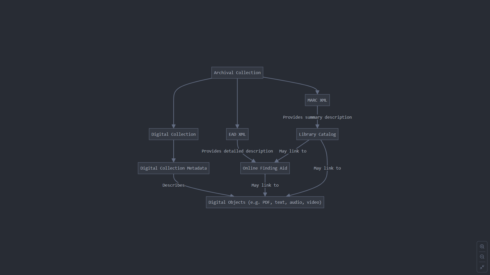

Note: Use Markdown Cheat Sheet if you need more functionality
https://www.markdownguide.org/cheat-sheet/
### Date: sep 24 2024 
- Topics of discussion
    - Concatenating metadata with documents
    - Repo organization
    - Data diagram:

- Action Items:

* [ ] Try and create manual questions (around 20-30)
* [ ] Add data diagram to final report
* [ ] Determine if FIASS can handle passing metadata; if not explore deeplake

---
### Date: sep 24 2024 
- Topics of discussion

|checked|unchecked|crossed|
|---|---|---|
|&check;|_|&cross;|
|&#x2611;|&#x2610;|&#x2612;|

- Action Items:
* [ ] Action Item 1
* [ ] Action Item 2
* [ ] Action Item 3
* [ ] Action Item 4
* [ ] Action Item 5
---
### Date: sep 24 2024 
- Topics of discussion

| Checkbox Experiments | checked header | crossed header |
| ---------------------|:--------------:|:--------------:|
| checkbox             |  &check; Row   |  &cross; row   |

- Action Items:
* [ ] Action Item 1
* [ ] Action Item 2
* [ ] Action Item 3
* [ ] Action Item 4
* [ ] Action Item 5
---
### Date: sep 24 2024 
- Topics of discussion

| Selection |        |
| --------- | ------ |
| &#x2610;  |

| Selection |        |
| --------- | ------ |
| &#x2611; |

- Action Items:
* [ ] Action Item 1
* [ ] Action Item 2
* [ ] Action Item 3
* [ ] Action Item 4
* [ ] Action Item 5
---
### Date: sep 24 2024 
- Topics of discussion

- Action Items:
* [ ] Action Item 1
* [ ] Action Item 2
* [ ] Action Item 3
* [ ] Action Item 4
* [ ] Action Item 5
---
### Date: sep 24 2024 
- Topics of discussion

- Action Items:
* [ ] Action Item 1
* [ ] Action Item 2
* [ ] Action Item 3
* [ ] Action Item 4
* [ ] Action Item 5
